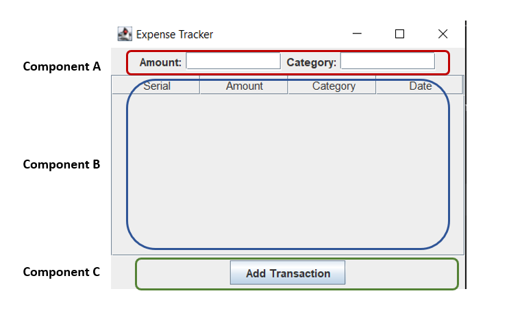

# hw1- Manual Review

The homework will be based on this project named "Expense Tracker",where users will be able to add/remove daily transaction. 

## How to build and test (from Terminal):
1. Make sure that you have Apache Ant installed.

2. Run ```ant``` in the root directory, which contains the build.xml build file.

3. Compiled java classes will be in the bin directory.

4. Run ```ant test``` to run all unit tests.

## How to run (from Terminal):
After building the project (i.e., running ant), run: ```java -cp bin ExpenseTrackerApp```

## How to clean up (from Terminal):
Run ```ant clean``` to clean the project (i.e., delete all generated files).

## Code Modification

Create a file named ```InputValidation.java```  to validate the ```amount``` and ```category``` field of this app. Some hints are as follows:
1. The ```amount``` should be greater than 0 and less than 1000. 
2. It should be a valid number. (The original code already implemented this check.)
3. The ```category``` should be a valid string input from the following list: "food", "travel", "bills", "entertainment", "other" . 


## solution
1. See the ```InputValidation.java``` for possible answers on code modification. In your answer, we looked for both logic to check error handling (by either returning error codes or throwing exceptions) as well as displaying any errors to the user (on the commandline UI, graphical UI, or both). Our answer is returning error codes and displaying an error dialog box when appropriate.

## Manual Review

### Some Examples of Satisfying Non-Functional Requirements
1. Usability: Enhancement of usability by the GUI. Generally using UI widgets in expected ways. 
2. Debuggability :The app is under version control. If a bug report is made about a particular version, it is possible to access that version and use debugging techniques to localize the cause of that bug in the version.
3. Understandability: Naming conventions are being used to improve program understanding.
4. Testability: There exists a unit test suite.
5. ...

### Other examples of violated non-functional requirement
1. Integrity or Security or Modularity: No data encapsulation is implemented to protect transaction data. 
2. Debuggability or Usability: The code generally lacks proper data error handling mechanisms. The InputValidation class now provides some data error handling.
3. Modularity: The code does not demonstrate a high level of modularity. in the ```ExpenseTrackerView.java```, there is a mix of view-related code and controller-related code. Could apply the MVC pattern as described in the MVC section.
4. Testability: The code often does not facilitate testing. In the ```ExpenseTrackerApp``` class, the main method directly creates instances of the ```ExpenseTrackerView``` and sets it as visible. This makes it difficult to write unit tests for the application logic, as it tightly couples the view and controller. Additionally the unit test suite does not seem adequate (i.e. too few test cases).
5. ...

## Modularity 



1. Component A: View. 
Alternative 1: This component is part of the view. It is responsible for displaying a new transition (i.e. the input fields for the amount and category).
Alternative 2: This component is part of the view (see above). The component is also part of the controller. This involves the input validation logic.
3. Component B: View
This component is also part of the view. It is responsible for displaying the list of existing transactions (i.e. the table).
4. Component C: Controller
This component is part of the controller. It is responsible for triggering the addition of a new transaction when clicked (i.e. button).

### Identify application source code

1. Model: 
The Transaction.java file represents part of the model component. It defines the Transaction class, which encapsulates the data related to a transaction, including the amount, category, and timestamp. In the ExpenseTrackerView.java file, it defines another part of the model component (as a list of transactions). In the design lecture, we discussed that separating the concerns between the model and controller can be fuzzy. The input validation logic may be considered part of the model component.
2. View: 
The ExpenseTrackerView.java file represents the view component. It extends the JFrame class and creates a graphical user interface (GUI) for the expense tracker application. It includes UI components such as text fields and a table for displaying transactions.
3. Controller:
The ExpenseTrackerApp.java file represents the controller component. It acts as the entry point for the application and handles the interaction between the view and model. The ExpenseTrackerView.java file also represents the controller component. It sets up event listeners (related to Component C above), and performs actions based on its user input. In the design lecture, we discussed that separating the concerns between the model and controller can be fuzzy. The input validation logic may be considered part of the controller component.
